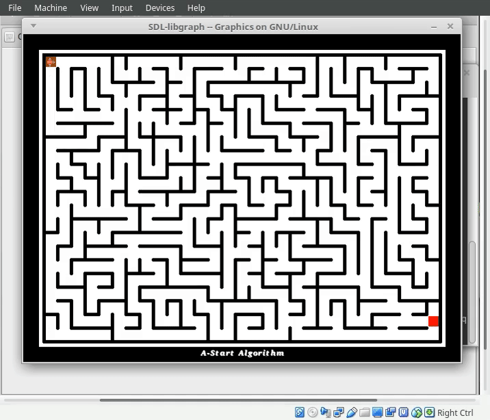
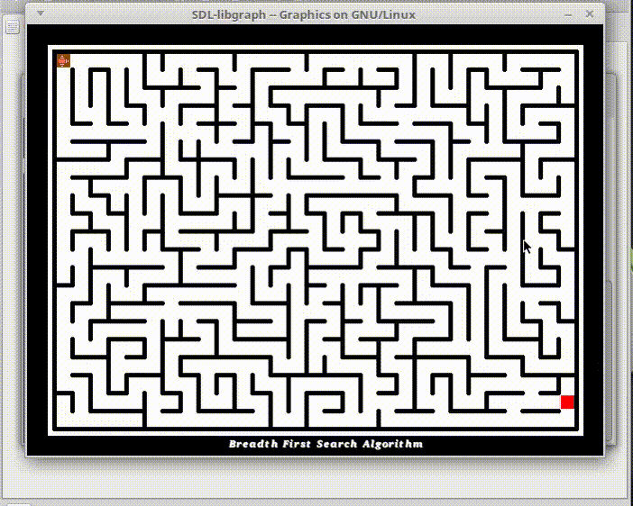
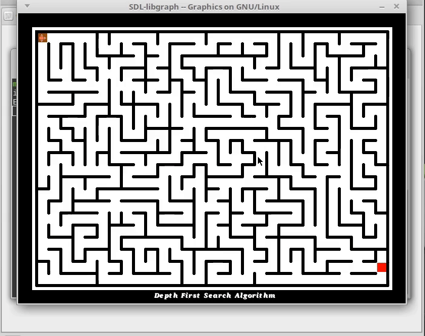
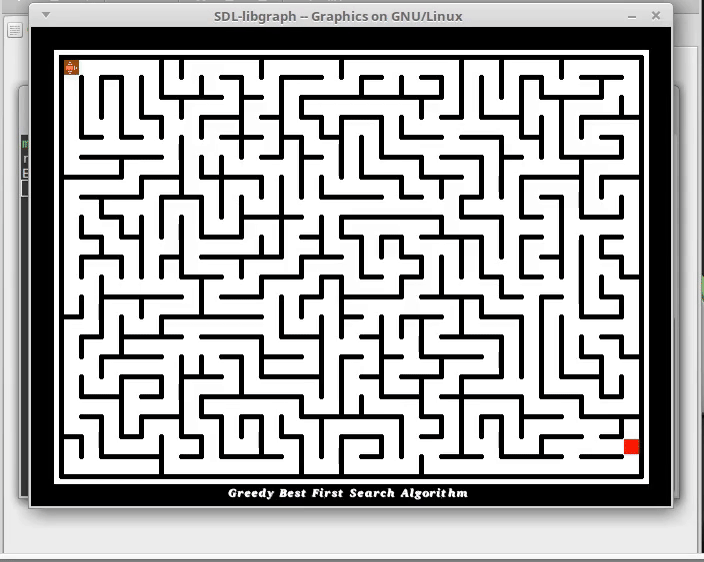
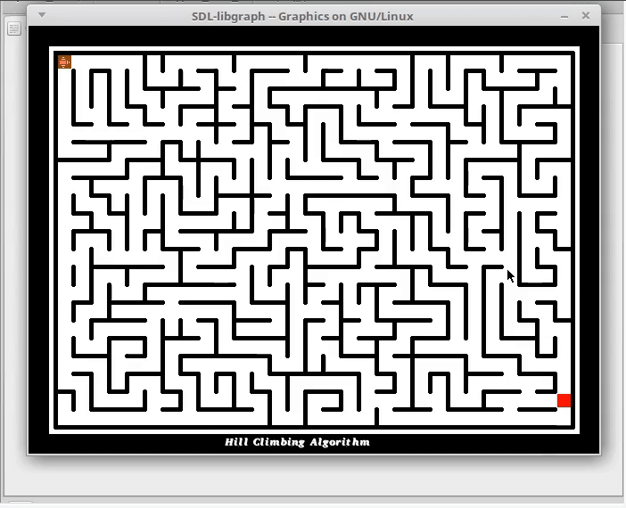

# 🏁 AI Maze Solvers  

**Important: This code is from 2016 and reflects my programming skills and practices at that time.** It has been uploaded as-is, without any modernizations, cleanups, or comment revisions. This preserves the original mindset and context of the code as it was written. Please be aware that it may contain outdated practices and stylistic choices.  

This repository contains implementations of various **pathfinding algorithms**, including Depth-First Search, Breadth-First Search, and others, used to navigate a maze. Each algorithm is written in **C**, demonstrating the core concepts through procedural programming.  


## 📌 Algorithms Implemented  
- 🔹 **A\* (A-Star) Algorithm**  
- 🔹 **Breadth-First Search (BFS)**  
- 🔹 **Depth-First Search (DFS)**  
- 🔹 **Greedy Best-First Search**  
- 🔹 **Hill Climbing Algorithm**  

Each algorithm explores the maze and finds a path (if possible) from the start to the goal.

---

## 📽 Demonstrations  
Videos demonstrating each algorithm solving the maze are available in the `Videos/` directory.  

📹 **Watch them in action!**  

<table>
  <tr>
    <td align="center">
      <strong>A-Star</strong><br>
      
    </td>
  </tr>
  <tr>
    <td align="center">
      <strong>BFS</strong><br>
      
    </td>
    <td align="center">
      <strong>DFS</strong><br>
      
    </td>
  </tr>
  <tr>
    <td align="center">
      <strong>Greedy BFS</strong><br>
      
    </td>
    <td align="center">
      <strong>Hill Climbing</strong><br>
      
    </td>
  </tr>
</table>

---

## 📂 Project Tree  
```
├── A-Star
│   ├── A-star
│   ├── A-star.c
│   ├── Maze.txt
│   ├── Structs.h
│   └── extra.h
├── Breadth-first search
│   ├── BFS.c
│   ├── Breadth-First-Search
│   ├── Close.txt
│   ├── Open.txt
│   ├── Structs.h
│   └── extra.h
├── Depth-first search
│   ├── Close.txt
│   ├── DFS.c
│   ├── Depth-First-search
│   ├── Open.txt
│   ├── Structs.h
│   └── extra.h
├── Greedy best first search
│   ├── Close.txt
│   ├── Greedy
│   ├── Greedy.c
│   ├── Open.txt
│   ├── Structs.h
│   └── extra.h
├── Hill Climbing
│   ├── Close.txt
│   ├── Hill-Climbing
│   ├── Hill-Climbing.c
│   ├── Maze.txt
│   ├── Open.txt
│   ├── Structs.h
│   └── extra.h
├── LICENSE
├── Maze.txt
├── REAME.md
└── Videos
    ├── A-Star
    │   ├── Fast.mp4
    │   └── Slow.mp4
    ├── A-Star.gif
    ├── BFS.gif
    ├── Breadth-first-search
    │   └── FAST.mp4
    ├── DFS.gif
    ├── Depth-first-search
    │   ├── Fast.mp4
    │   └── Slow.mp4
    ├── Greedy best first search
    │   ├── Fast.mp4
    │   └── Slow.mp4
    ├── Greedy-BFS.gif
    ├── Hill Climbing
    │   ├── Fast.mp4
    │   └── Slow.mp4
    └── Hill-Climbing.gif
```

---

## 🚀 Algorithm Demonstrations  

### ⭐ A* Algorithm  
The A* algorithm is a heuristic-based search that finds the shortest path efficiently.  
  

### 🔵 Breadth-First Search (BFS)  
BFS explores nodes layer by layer and guarantees the shortest path in an unweighted maze.  
  

### 🔴 Depth-First Search (DFS)  
DFS explores as deep as possible before backtracking, but does not guarantee the shortest path.  
  

### 🟡 Greedy Best-First Search  
Greedy BFS selects the most promising node using heuristics but does not guarantee an optimal solution.  
  

### 🟢 Hill Climbing  
A local search algorithm that moves in the direction of increasing heuristic value, but may get stuck in local optima.  
  

---

## 📄 Maze File (`Maze.txt`)  
The `Maze.txt` file contains a text-based representation of the maze used for all algorithms. Example format:
the first line contains the Width and Height of the matrix
```
30 22
_!_!_!_!_!_!_!_!_!_!_!_!_!_!_!_!_!_!_!_!_!_!_!_!_!_!_!_!_!_!
_!S   __   ! !    __ !  ____ !  _     _  !   !  __ !  ____ !
_! ! ! ! ! !___!__ !__ !  _____!___!___! ! ! ! ! !_____!   !
_! ! ! ! !__ !  ___!  _! !__  ____   !  _! !___!   !  ___!_!
_! !__ !__ !   !  _!__ !__ !_!   ! !___   ____ !_! ! !  __ !
_!  _____ __ !     !  _! !__ ! ! !____  ____ !__ ! !_____! !
_!_____!  ___! !_!___    !   ! !____ !____ ! !  _____!  ___!
_!  _____!  _!__ !   ! ! ! ! _____ !__ !  _! ! !  __ ! !   !
_!   !__   !   ! ! !___!__     ________  !____ !__ ! !___! !
_! !__ !_! ! ! !___!   !  _! !__  __  _!____ !  __ !    __ !
_!  _!__ !  _!  _____!_!  _!__ ! ! !__   ! ! ! !  _! ! !__ !
_! !   ! ! ! !____ !  ___!  __ !__  _! ! ! !__ !__ ! !   !_!
_!   !________ !  ___!    _! !_____!  _!____ !__  _  ! !__ !
_!_! !   !  ___!______ ! !   !__    ____ ! !____ !   !___! !
_!  _! !___!__  ______ !___! !  _! ! !  _!____ ! ! !    __ !
_! !  _!____      __ !____ !  __ !__ !______ ! ! ! ! !__ !_!
_!   !  ____ !_!__ ! !_____! !  _!  ___!  ___! ! ! !___!   !
_! !___!  _! !  ___!______ ! !   !___!  _!______ !____ !_! !
_!  __ !  ___! !__  __   !___!_!____ !__ !  __ !____ !____ !
_!__ ! !_!   !__ ! ! ! !__ !  ____ !  _! ! ! ! !  ____  _! !
_! ! !_____!  _! !___!__ ! ! !  _! !    _!__ !___!__  ____G!
_!_________!_____________!___!_______!_____________________!
```
